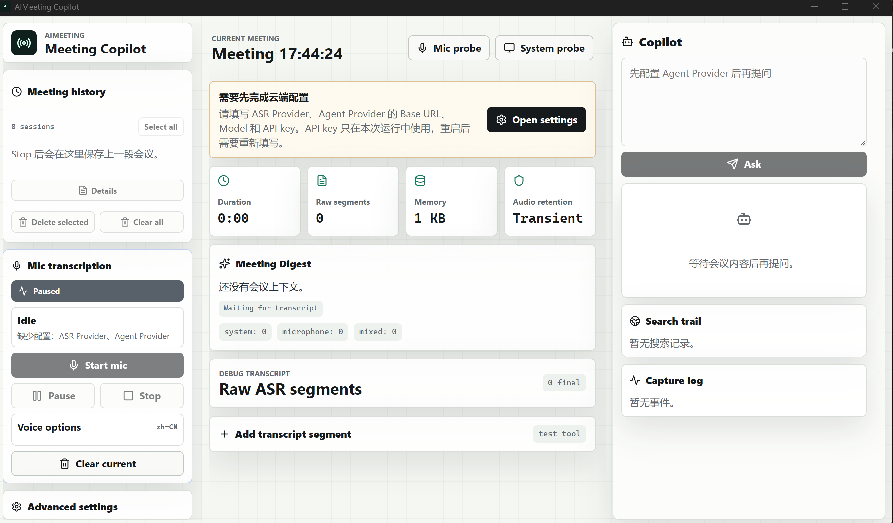

# AIMeeting

一个 Windows 实时会议 AI 助手原型，围绕麦克风流式语音识别、增量会议纪要和基于会议证据的 Copilot 问答构建。

> **作品集公开版：** 本仓库是可运行、可验证的公开作品版本，不等于完整生产系统。公开源码与完整本地原型的差异、最短验证路径及数据边界见 [作品集公开版说明](docs/PORTFOLIO_EDITION.md)。



> 上图是完整本地原型的展示素材，包含当前公开源码未提供的 System probe、系统声来源和混合音频统计；它不代表克隆本仓库后可得到完全相同的能力。

## 当前稳定边界

- 麦克风 PCM 采集与 DashScope WebSocket 流式 ASR。
- interim/final 转写、简繁规范化和文本唤醒短语。
- 配置 OpenAI-compatible 文本模型后，可生成增量会议摘要、行动项与基于当前会议记录的问答。
- 手工输入转写文本，无麦克风和 API Key 时可验证时间线、文本唤醒、停止归档与本地历史。
- 本地会议历史；API Key 只保存在运行内存，不写入 localStorage。

当前不支持系统声 WASAPI loopback、自动说话人分离、通用 ASR Provider 抽象和开箱即用的联网搜索。界面只开放麦克风来源，搜索默认关闭。

## 快速启动 Web 演示

```powershell
npm install
npm run dev
```

也可以双击 `run_demo.cmd`。Web 演示可使用手工转写输入；真实流式 ASR 需要 Tauri 桌面运行时与 DashScope Key。
递增纪要和 Copilot 需要另行配置 OpenAI-compatible Agent Provider。

## 桌面开发

```powershell
npm run desktop:dev
```

需要 Rust stable、Windows C++ Build Tools、WebView2 和可用的麦克风权限。

## 文档

- [作品集公开版说明](docs/PORTFOLIO_EDITION.md)
- [运行手册](docs/RUNBOOK.md)
- [架构说明](docs/ARCHITECTURE.md)
- [作品边界](docs/PORTFOLIO_SCOPE.md)
- [演示脚本](docs/DEMO_SCRIPT.md)

## 验证

```powershell
npm run lint
npm run build
cargo test --manifest-path src-tauri\Cargo.toml
```

## 发布状态

这是一个供作品审阅的 source-available 仓库，不是开放源代码项目；未经许可不得复制、修改、再发布或用于商业用途。详见 [LICENSE](LICENSE)。Windows 安装包尚未配置代码签名。
